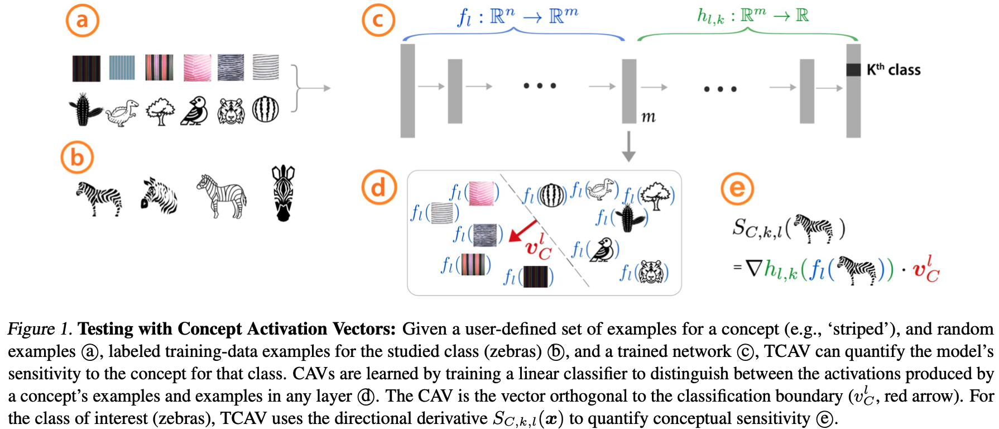

# TCAV-XAI

**tl;dr** Extend TCAV to provide attribute-based human-friendly explanations.

## Introduction
The following are a few desirable qualities in good explanations {[1](https://doi.org/10.1016/j.artint.2018.07.007)}:
1. Contrastive (compared to counterfactual cases) to explain why A happened, instead of B.
2. Social interactions: "Someone" explains "something" to "someone".
3. Selected: Iteratively provide more information to explainee until they are satisfied.

A number of recent XAI works (cf. class-reading-lists) have attempted to provide contrastive explanations (#1). Recent advances in NLP may contribute to formulating explanations as social interactions, but this is not the focus of our work (#2). To the best of our knowledge, there is no prior work in the XAI literature that attempts to provide *selected* explanations for deep neural networks (#3), and this is the focus of our work.

While selecting the information to be presented, we may further consider {[2](https://www.youtube.com/watch?v=8XmGenDIXv0)}:
1. Recent/ specific/ salient events are more useful than older ones.
2. Abnormal events are important.
3. Communicating immoral/ unusual situations is important.
4. Conveying intentions is important.

We propose to extend Testing of Concept Activation Vectors (TCAV) {[3](https://proceedings.mlr.press/v80/kim18d.html)} in an attempt to generate automated explanations that satisfy a few of the above properties.

## TCAV
Testing of Concept Activation Vectors (TCAV) {[3](https://proceedings.mlr.press/v80/kim18d.html)} is a model interpretability technique using human-friendly concepts. TCAV attempts to learn an “interpretation” of AI models and can be viewed as a mapping `g`, which attempts to transform the AI's representation space, `E_m`, to human concepts, `E_h`:

`g : E_m → E_h`

Here, `E_m` are embeddings from any neural network layer, while `E_h` are human-friendly concepts such as color, texture, or demographics.

The following is a visual summary of TCAV, borrowed from the paper {[3](https://proceedings.mlr.press/v80/kim18d.html)}:

## Selecting an appropriate language to communicate
1. Humans reason and communicate about objects using object affordances. Object attributes (color, shape, texture) are a natural means for communicating about object affordances. Consider using attributes from datasets such as [LFW](http://vis-www.cs.umass.edu/lfw/), [Places](http://places2.csail.mit.edu), or [CalTech-UCSD-Birds](https://www.vision.caltech.edu/datasets/cub_200_2011/).
2. Another possible form of communicating about objects may be through hierarchies. For example, we may reason about the [ImageNet-1000](https://www.image-net.org) data using the object class [hierarchy](https://observablehq.com/@mbostock/imagenet-hierarchy) derived from the [WordNet](https://wordnet.princeton.edu) lexical database.
3. Next, we may use the features themselves when communicating about individual datapoints. For example, we may reason about subjects in ProPublica's [COMPAS](https://github.com/propublica/compas-analysis) dataset based on their demographic features. Contrastive explanations may be generated for each feature by comparing the `cosine` distances between per-subject activations for each of the feature's TCAV embeddings.
4. Finally, we may conduct human-subject studies to discover human-concept based hierarchies in the data. Though, these hierarchies may not necessarily be universal and will depend on the diversity and sample size of the human subjects.

We begin our exploration by working with #1 and #2.

## Proposed Method
Train linear/ non-linear Concept Activation Networks on the final embedding of a neural-net (though {[3](https://proceedings.mlr.press/v80/kim18d.html)} suggests working with both internal activations as well as the final layer but only works with linear activations). In the case of hierarchies, these embeddings may be trained iteratively corresponding to each node in the hierarchy.

### Proposed Experiment Ablations
1. Selectively construct explanations based on the most unusual attributes/ features. Though, measuring the effectiveness of this method may require human-subject evaluation studies.
2. Consider the effect of injecting noise into the data. Since we can control the concept data generation process, we can define the concept data noisily.
3. Instead of using hierarchies, consider #3 and similarities/ differences in feature activations when comparing data points may be used to explain abnormal/ unusual contrasts/ counterfactuals.

### Human Study
(It's very unlikely we will do this, since, human subject studies are quite resource intensive and will make the effort required beyond what is reasonable for a class project. Consider this if submitting to FAccT/ ICML.)
1. Train a neural-net on, say, the ImageNet dataset. Use TCAV for users to understand how the network classifies objects and create “explanations” to be able to interact with the system and get insights on making predictions.
2. Teach a human what the ML is capable of doing in terms of concepts that they understand. Measure interpretability/intelligibility/ trust/ trustworthiness.
3. Skip teaching. Directly explain our “move 37”. Measure intelligibility and trust.
Hopefully, our TCAV-based intervention will result in a difference and will help humans understand the neural-net better.

## References
1. Miller, T. (2019). Explanation in artificial intelligence: Insights from the social sciences. Artificial intelligence, 267, 1-38.
2. Miller, T. (2022). Are the inmates still running the asylum? Explainable AI is dead, long live Explainable AI! IJCAI 2022 Keynote. [link](https://www.youtube.com/watch?v=8XmGenDIXv0)
3. Kim, B., Wattenberg, M., Gilmer, J., Cai, C., Wexler, J., & Viegas, F. (2018, July). Interpretability beyond feature attribution: Quantitative testing with concept activation vectors (tcav). In International conference on machine learning (pp. 2668-2677). PMLR.
4. Kim, B. (2022). Developing a language to shape our relationships with AI. ICLR 2022 Keynote. [link](https://www.youtube.com/watch?v=Ub45cGEcTB0)

## Appendix A: Ishan's ramblings about explanations.
1. Building glass-box models has often been the go-to when criticizing complex black-box ML models. However, linear models may themselves not be interpretable. Cf. [The Mythos of Model Interpretability](https://dl.acm.org/doi/10.1145/3236386.3241340).
2. According to Chenhao Tan, "humans are biased and may have incomplete knowledge” {[link](https://medium.com/@ChenhaoTan/human-centered-machine-learning-a-machine-in-the-loop-approach-ed024db34fe7)}. Thus, using interpretable glass-box models that are inherently explainable to humans should not be the goal of large-scale AI systems.
3. Instead, we should develop the appropriate language {[4](https://www.youtube.com/watch?v=Ub45cGEcTB0)} for humans to communicate with AI. We need to find the appropriate “bridges” along which humans and AI systems can understand and help each other.
4. TCAV is a good proxy for developing such a language.
    1. “TCAV learns concepts from examples. For instance, TCAV needs a couple of examples of female, and something not female to learn a "gender" concept. We have tested a variety of concepts: color, gender, race, textures and many others.
    2. Humans think and communicate using concepts, and not using numbers (e.g., weights to each feature). When there are lots of numbers to combine and reason about (many features), it becomes harder and harder for humans to make sense of the information they are accounting for.
    3. TCAV instead delivers explanations in the way humans communicate to each other.”
5. [Move 37](https://www.deepmind.com/research/highlighted-research/alphago/the-challenge-match) suggests that large-scale AI systems may not “think” in the same ways as humans do. Since the user does not understand the AI, it is expected to result in lower perceived trust. However, IMO, constraining AI to think in ways that can be easily explained to humans is not the correct way to address this. Instead, we want to develop an appropriate language for humans and AI systems to communicate with each other. This *language* will lead to XAI that helps humans understand the un-intuitive super-human actions/ recommendations that large-scale AI systems are capable of generating.

## Appendix B: Rants = Less facts, more opinions.
1. The reason that tabular datasets are dominated by shallow models is that the underlying data distributions are not complex enough to challenge deep neural networks. Though, a few recent methods appear to be catching up with shallow ML methods on tabular data {[ref1](https://arxiv.org/abs/2205.14120), [ref2](https://arxiv.org/abs/2203.05556), [ref3](https://arxiv.org/abs/2112.02962)}. See Sebastian Raschka's post on [Deep Learning for Tabular Data](https://sebastianraschka.com/blog/2022/deep-learning-for-tabular-data.html) for an overview of the field.
2. Elon Musk intended for Tesla to achieve L5 autonomy using vision as the only sensory input. This was idiotic. Thankfully, they have now moved towards using radars and ultrasonic sensors.
